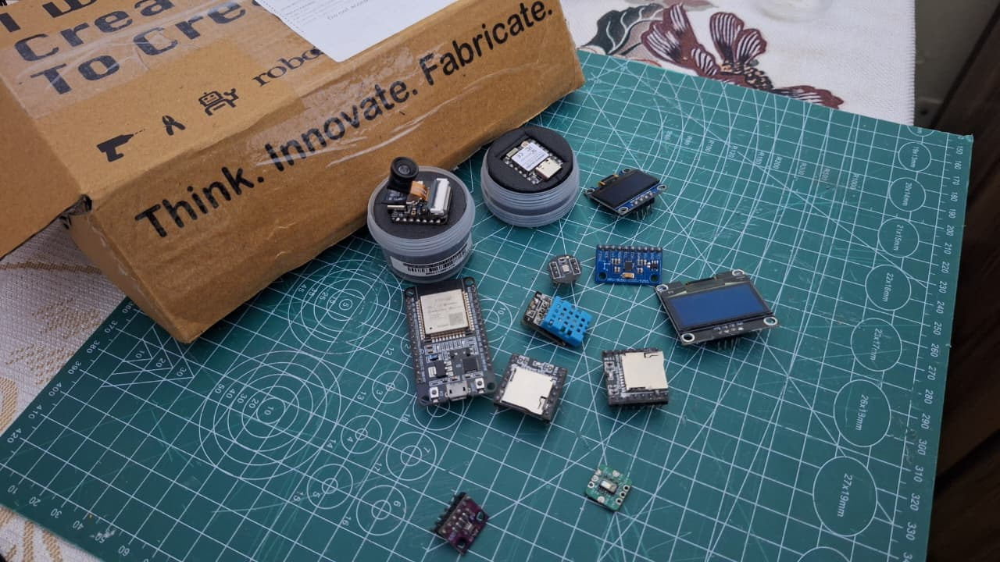
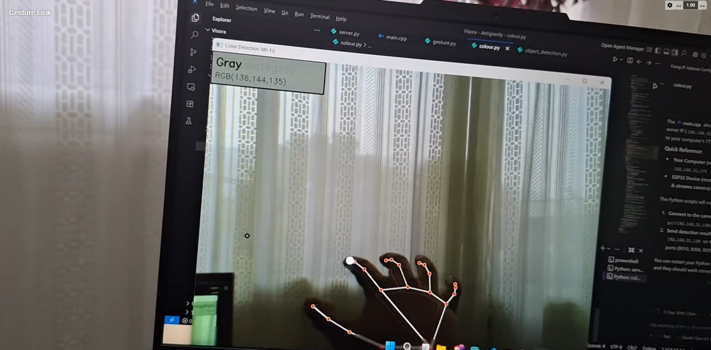
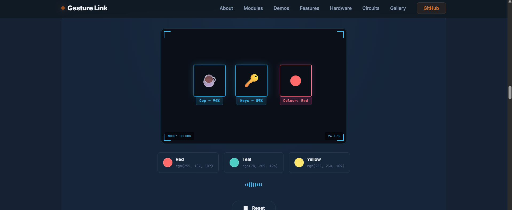
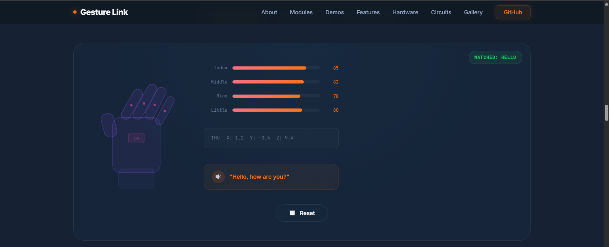
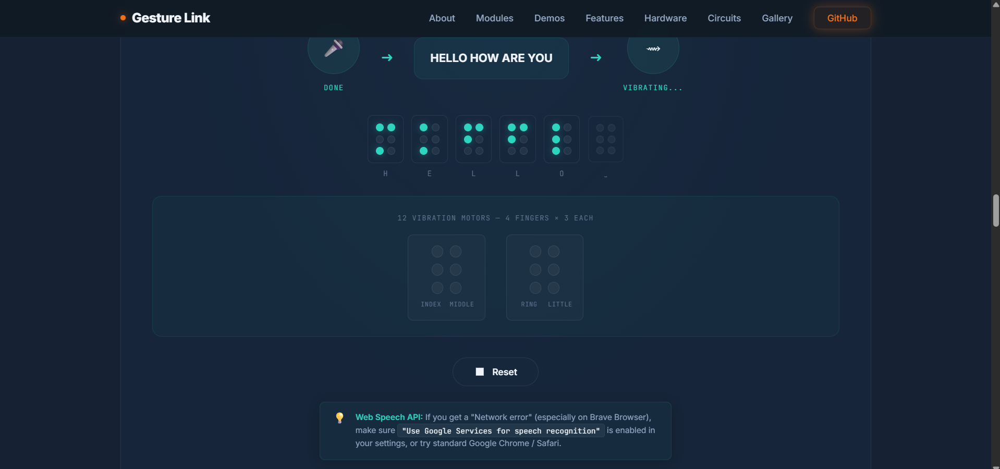
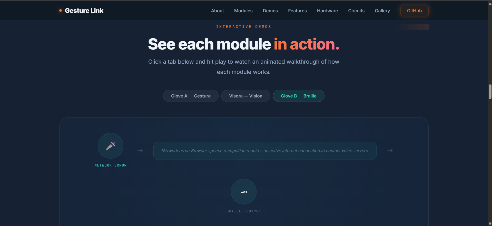

# Developer Journal: The Gesture Link Journey
*A log of late nights, burnt sensors, git merge conflicts, and small victories.*

Total Time Spent: **125 Hours** (32 entries)

---

### **January 3, 2026 — Brainstorming & Concept**
*Time spent: 3.0 hours*

So I've been chewing on this idea for a couple of weeks now. There are tons of individual assistive gadgets out there — smart glasses that read out signs, or sign language gloves that output text — but almost none of them focus on *two-way* communication between two differently-abled people at the same time. Like, how does a visually impaired person talk back to a speech-impaired person without some third party standing in the middle? That question was living rent-free in my head.

The plan is to build **Gesture Link** as a fully offline, wearable system consisting of three components:
- **Visora**: Smart glasses (ESP32-S3 Sense) that stream video to run local object/colour detection and read things out via audio.
- **Glove A**: The gesture-to-speech glove (ESP32-C6 + flex sensors + IMU) for the speech-impaired user.
- **Glove B**: The speech-to-Braille glove (ESP32 + I2S Mic + vibration motors) for the visually impaired user.

Spent the evening sketching block diagrams on paper: how data flows from the camera to YOLO, from the flex sensor reads to the gesture state machine, from microphone audio to Whisper STT to vibration pin patterns. It's a big system. I'm genuinely excited but also a little terrified about the amount of hardware integration this is going to take. Three different microcontrollers, three different wireless communication protocols — this is going to be a marathon.

---

### **January 8, 2026 — Sourcing & Ordering**
*Time spent: 4.5 hours*

Spent hours today comparing microcontrollers across Seeed Studio, Adafruit, and a bunch of Indian resellers. I needed boards small enough to be wearable but powerful enough to handle I2S audio and camera streaming simultaneously. After a ton of tab-switching and spec sheet reading, I landed on:
- **ESP32-S3 Sense** for Visora — has a built-in camera connector, PDM mic, and enough processing headroom.
- **ESP32-C6** for Glove A — low power, has analog inputs for flex sensors, and supports Wi-Fi without the bulk.
- **Standard ESP32 Dev Module** for Glove B — simple GPIO for driving all the vibration motor transistors.

Then came ordering the rest: flex sensors, MPU6050 6-axis IMU, INMP441 I2S digital mic, ST7735 TFT display, DFPlayer Mini MP3 module, flyback diodes, 2N2222 NPN transistors, and a bag of 12 coin-type vibration motors. My cart looked like a mad scientist's shopping list. Checking out made me feel a little sick, but getting the shipping confirmations felt like a small victory.

---

### **January 15, 2026 — Unboxing & Basic Check**
*Time spent: 2.5 hours*

The delivery boxes finally arrived and honestly it felt like Christmas. Tore open every package and laid everything out on my desk in order. Verified the parts list one by one — nothing missing, which was a relief given how many small components were rolling around in bubble wrap. Ran the basic blink sketches on all three ESP32 boards just to make sure none of them were dead on arrival. They all came alive immediately. Staged everything into labelled zip-lock bags. Tomorrow the actual building starts.

---

### **January 22, 2026 — PlatformIO Setup & Camera Test**
*Time spent: 4.0 hours*

Installed VS Code and spent a solid chunk of time configuring the PlatformIO environment. Arduino IDE is just too messy for a project with three separate boards each having different chips and library dependencies. PlatformIO's `platformio.ini` per-project configuration is way cleaner. Got the ESP32-S3 Sense basic camera HTTP server example running on the board — pointed my phone's browser at its IP and saw a live grainy MJPEG stream. Super satisfying.

Soldering the headers onto the tiny ESP32-S3 board was incredibly stressful. The pads are extremely small. The iron was slipping and at one point I almost bridged two pads together. Got there in the end without destroying anything.

---

### **January 29, 2026 — Glove A: Flex Sensors & DFPlayer Nightmare**
*Time spent: 7.5 hours*

Two massive days bundled into one entry because honestly they blurred together into a single extended late-night session.

Started by properly assembling Glove A. Spent the first part of the evening stitching four 2.2-inch flex sensors onto a cheap gardening glove using conductive thread. The thread kept tangling, fraying mid-stitch, and generally refusing to cooperate. I had to be super careful about the routing so the conductive lines wouldn't cross and short when I bend my fingers. By the time all four sensors were stitched down and wired to the ESP32-C6 analog inputs, I was already a few hours deep.

Then came the DFPlayer Mini. What followed was one of the most aggravating debugging sessions of my life. Wired the DFPlayer to the ESP32-C6 over software serial, uploaded the firmware, bent a finger — and got nothing but a constant *tick tick tick* from the speaker. No audio, just a rhythmic clicking sound. I checked the wiring three times. I tried different baud rates. I swapped the TX/RX pins. Still clicking.

Eventually figured out the DFPlayer is *extremely* picky about two things: the SD card needs to be formatted as FAT32 (not exFAT, which is the Windows default for anything over 4GB), and the mp3 files must live in a folder named exactly `/mp3/` with zero-padded filenames like `0001.mp3`. Once I reformatted the card and restructured the files, I also had to solder a 1kΩ resistor in series with the RX line to kill the serial interference that was causing the clicking. When it finally said "Hello" cleanly through the speaker the first time I bent my index finger — that was a real moment.

---

### **February 3, 2026 — Glove A: Flex Sensor Calibration**
*Time spent: 3.0 hours*

Tested the flex sensors properly today. The raw ADC readings were all over the place — they drift based on room temperature, how tightly the glove is worn, and even which direction I bend my wrist. Wrote a calibration routine in C++ that captures the "resting flat" and "fully bent" values for each finger and normalises the reads to a clean 0–100 percent scale. After calibration, the readings are stable and consistent across sessions. Also spent time tuning the gesture recognition thresholds so slight natural hand movements don't constantly misfire a gesture.

---

### **February 10, 2026 — Glove A: IMU Integration**
*Time spent: 5.5 hours*

Wired the MPU6050 IMU to the I2C pins. Flex sensors alone only tell me if fingers are bent — not what direction the hand is actually pointing or tilting. If I want to distinguish "Hello" (hand flat and waving) from "Help" (hand tilted sharply upward), I need spatial orientation data too. Tested pitch and roll output on the serial plotter and got clean, stable curves. Wrote the fusion logic that combines the IMU tilt reading with the flex percentages to determine gesture class.

---

### **February 17, 2026 — Glove A: Combining Sensors & OLED**
*Time spent: 3.0 hours*

Brought everything together. Wrote the full C++ state machine that combines the IMU tilt and all four flex sensor percentages into recognized gesture outputs. Added a 0.96″ OLED screen via I2C to display the currently active gesture string. Watching the screen switch from "IDLE" to "HELLO" as I wave my hand for the first time felt incredible. Spent the rest of the session tightening up the state machine — adding debounce delays so the same gesture doesn't trigger multiple times from minor hand wobble.

---

### **March 1, 2026 — Glove A: Wi-Fi Telemetry Dashboard**
*Time spent: 3.5 hours*

Coded the ESP32-C6 to host a tiny local web server. It broadcasts live sensor readings — all four flex percentages, IMU pitch, roll, and the current gesture string — as a JSON endpoint over local Wi-Fi. Built a minimal HTML dashboard on top of it that charts everything in real time using a little Canvas graph. Pulling it up on my phone while bending fingers and watching the lines jump around is genuinely cool. Also useful for debugging without needing to keep the laptop connected via USB.

---

### **March 12, 2026 — Glove B: Tactile Matrix Layout & Transistor Driver**
*Time spent: 7.5 hours*

Another double-session that I'm combining here. Shifted focus completely to Glove B — the Speech-to-Braille glove.

The core idea is to trigger 12 coin-type vibration motors mapped to a Braille cell layout across the fingers and palm. Standard Braille has 6 dots per cell, but I wanted extra spatial resolution so I went to 12 motors. Spent the first part of the evening marking the motor placement grid on the inside of a glove with a fabric pen, making sure they'd actually align with where the tactile nerve density is highest on the hand. Then hot-glued the first round of motors in place for a fit test.

The second half of the session was all about the driver board. The ESP32 GPIO pins max out at 20mA, but each vibration motor draws around 70mA at peak. You simply cannot drive them directly — the microchip will either thermally throttle or just die. Designed a driver circuit using 2N2222 NPN transistors as low-side switches with 10kΩ base resistors, and a 1N4007 flyback diode across each motor to absorb the inductive spike when the motor stops. Mapped out the schematic for all 12 channels on a piece of graph paper before committing to the board layout.

---

### **March 22, 2026 — Glove B: Solder Sesh**
*Time spent: 4.5 hours*

Spent the night soldering. 12 NPN transistors, 12 flyback diodes, 12 base resistors, and about a thousand tiny jumper wires all on a 5×7cm protoboard. The soldering iron was going for nearly four hours straight. The board looks absolutely chaotic — a dense rat's nest of copper wire — but it's doing exactly what it's supposed to do. Powered it up, fed it a test sequence via the serial monitor, and watched all 12 motors fire in order without a single short circuit or blown transistor. That genuinely felt like a miracle.

---

### **March 27, 2026 — Glove B: Braille Mapping C++**
*Time spent: 2.5 hours*

Wrote the ASCII-to-Braille translation layer in C++. Defined a lookup table mapping every printable character to its standard Braille binary representation (e.g. `'a'` → `0b100000`, `'b'` → `0b110000`) and then mapped each bit position to the corresponding GPIO pin driving a transistor. Now when I send a character string over the serial monitor, the motors fire in the exact Braille pattern for each letter. Did a blind test on my own palm — couldn't tell the letters apart yet, but that's a practice thing, not a hardware thing.

---

### **April 2, 2026 — Glove B: Adding the OLED Display**
*Time spent: 4.0 hours*

Added a 1.3″ OLED to Glove B via I2C. It displays the currently received text string and highlights the active Braille dot numbers being fired. Makes debugging way faster — instead of guessing which motors should be on by looking at the GPIO state table, I can just look at the screen. Also added a character-by-character scroll animation so longer strings process at a readable pace for the wearer.

---

### **April 8, 2026 — Glove B: I2S Mic Wiring**
*Time spent: 3.0 hours*

Wired the INMP441 I2S digital microphone to the ESP32. The INMP441 is a 24-bit PDM-to-I2S mic — way better signal-to-noise ratio than any analog mic, but the wiring needs to be precise. Soldered the SCK (clock), WS (word select), and SD (data) pins to the ESP32, and the L/R select pin tied to ground for mono left-channel capture. Verified it was outputting actual audio data by dumping raw bytes to the serial monitor and checking that the values were responding to sound.

---

### **April 14, 2026 — Glove B: I2S DMA Buffering**
*Time spent: 4.5 hours*

This session was a proper fight. I was getting constant static, loud clicks, and DMA overflow errors every few seconds. The issue was the I2S DMA buffer size not being in sync with the actual read loop timing. If the buffer fills up before the CPU reads it, you get overflow corruption and that's what the static was. Spent a couple of hours adjusting buffer counts and sizes, tweaking the sample rate between 8kHz, 16kHz, and 32kHz. Eventually landed on 16kHz mono with a buffer count of 8 × 512 samples, which gives clean audio with minimal latency and no overflows.

---

### **April 20, 2026 — Glove B: WebSocket Audio Server**
*Time spent: 3.0 hours*

Wrote a local Python server that sits on the host PC and receives raw PCM audio chunks from the ESP32 over a persistent WebSocket connection. Once it buffers enough audio, it feeds it to OpenAI Whisper running locally for offline speech-to-text transcription. The text output is then sent back to the ESP32 to trigger the Braille motor pattern. End-to-end latency is around 600–800ms, which is surprisingly good for local Whisper inference and completely good enough for real conversational use.

---

### **April 26, 2026 — Visora: ESP32-S3 Camera & YOLOv8x Detection**
*Time spent: 6.0 hours*

Switched focus to Visora — the smart glasses module. This was a big day combining the camera setup and the detection pipeline, both of which ended up bleeding into each other anyway.

First got the ESP32-S3 Sense camera frame streaming working properly. The default camera server example gives you a full MJPEG stream, but the frame sizes and JPEG quality needed serious tuning. Went with QVGA at 20fps — high enough to be useful for object detection, low enough to keep the Wi-Fi bandwidth manageable over a local network.

Then set up the host PC script to pull individual JPEG frames from the HTTP stream and pipe them through `ultralytics` YOLOv8x. The first time I ran it I was genuinely impressed — it correctly drew bounding boxes around a cup, a laptop, and even my hand in real time at around 8–12 FPS on CPU. The detection labels get mapped to short audio strings that will eventually play through the I2S speaker on the glasses frame.

---

### **May 8, 2026 — Visora: Colour Detection Script**
*Time spent: 6.0 hours*

Wrote the colour detection script. Uses OpenCV to sample HSV values from a central region of interest in the camera frame and maps the hue/saturation/value combination to human-readable colour strings (like "dark blue" or "light green"). The tricky part was making it robust to shadows and different lighting conditions — spent a lot of time tuning the HSV threshold ranges and testing under fluorescent lights, daylight, and in dim rooms. Eventually added a short-window averaging filter so the colour name doesn't flicker on every frame.

---

### **May 14, 2026 — Visora: Git LFS Troubleshooting**
*Time spent: 4.0 hours*

Tried pushing the whole codebase to GitHub and immediately got a rejection: the `yolov8x.pt` model file is 137MB and GitHub's hard limit is 100MB. Spent a while figuring out Git LFS — had to install the extension, run `git lfs track "*.pt"`, update `.gitattributes`, and then rewrite the last commit to properly store the model pointer instead of the raw binary. Also set up the `.gitignore` properly so large generated files don't sneak back in. Finally got a clean push through.

---

### **May 20, 2026 — Visora: I2S Audio Output**
*Time spent: 3.0 hours*

Wired a MAX98357A I2S digital amplifier module to the ESP32-S3 Sense. This lets the glasses do local text-to-speech audio output without any Bluetooth speaker or external module — just a tiny speaker wired directly to the amplifier board. Tested with a basic sine wave first to verify the signal path was clean, then integrated the ESP8266Audio library to play back pre-generated TTS WAV files. Audio quality through the small speaker is surprisingly clear.

---

### **May 26, 2026 — Web App: Visora Simulator**
*Time spent: 4.0 hours*

Built out the Visora interactive simulator section on the web app. The simulator lets you upload or select a test image and runs a JavaScript-based overlay that mimics how Visora's object detection and colour detection would respond. Bounding boxes draw themselves on the canvas with animated labels. Added the detection result as a spoken audio string using the Web Speech API so the experience mirrors what the actual glasses would do. Satisfying to see the whole detection experience represented on-screen without needing the physical hardware plugged in.

---

### **May 31, 2026 — Web App: HTML Skeleton**
*Time spent: 2.5 hours*

Began building the project landing page in `/docs`. Designed the full-page layout — hero section, stats, module cards, circuit diagrams, interactive simulators, gallery, and journal. Set up the CSS grid and flexbox layout system. Decided early on to go with a dark glassmorphic aesthetic with subtle glow accents that fit the "wearable tech" vibe. Got the basic navigation and section anchors all wired up.

---

### **June 1, 2026 — Web App: Glove A Simulator**
*Time spent: 4.0 hours*

Coded the Glove A interactive web simulator. The user can click individual fingers on an SVG glove illustration and see the flex sensor percentage bars update live. When the flex and tilt state match a recognized gesture, the corresponding word plays back as audio using the Web Speech API and the gesture name lights up on screen. Also added a live "sensor readings" panel that animates in real time as you interact. Genuinely impressed with how well it communicates the actual glove behavior to someone who hasn't seen the hardware.

---

### **June 3, 2026 — Web App: Glove B Voice Simulator**
*Time spent: 3.0 hours*

Implemented the Glove B web simulator. You speak into your microphone and the browser's Web Speech API transcribes it, then the site animates the Braille dot pattern on a visual hand diagram corresponding to each character. Each motor "fires" with a brief highlight animation. You can see in real time which dots a letter would activate on the physical glove. It's an incredibly effective way to demonstrate the system to someone who's never touched the hardware.

---

### **June 5, 2026 — Web App: Brave Browser Fix**
*Time spent: 4.5 hours*

Spent a frustrating afternoon debugging why the voice simulator completely broke on Brave. Turns out Brave blocks the Web Speech API by default via its aggressive shields — it intercepts the Google speech recognition request and refuses it silently. Added a browser detection function that checks the user agent on page load, and if Brave is detected, shows a friendly warning modal explaining exactly which Brave shield setting needs to be toggled. Also added a fallback notice below the mic button for any browser that doesn't support the Web Speech API at all.

---

### **June 6, 2026 — Web App: Stats & Growth Graph**
*Time spent: 4.0 hours*

Sourced real WHO statistics on assistive technology demand and coded the animated SVG line graph section. The graph lines draw themselves progressively as you scroll down into the section — handled with an IntersectionObserver watching the SVG container. Also added the WHO stat callout cards that pop in with a stagger animation. Spent extra time making the graph scale properly on mobile by recalculating the SVG viewBox dynamically on resize.

---

### **June 8, 2026 — Web App: GitHub Pages Path Fixes**
*Time spent: 2.5 hours*

Deployed to GitHub Pages and immediately found that about half the images were 404ing. The issue was that images were being referenced from paths relative to the repo root, but GitHub Pages serves from the `/docs` subdirectory. Spent the session auditing every `src=` and `href=` attribute in `index.html`, moving all assets into `/docs/Images/`, and updating the HTML links. Also fixed a few CSS `url()` references that had the same problem. Everything loads clean now.

---

### **June 10, 2026 — Compilation & Code Cleaning**
*Time spent: 5.5 hours*

Went through all three PlatformIO projects — `VISORA/`, `GLOVE-A/`, and `GLOVE-B/` — and cleaned them up for public release. Removed every leftover `Serial.println` debug statement, commented out development-only sections, and made sure they each compile from scratch with zero warnings. Also standardised the code style: consistent indentation, clear variable names, and a brief comment block at the top of each main `.cpp` file explaining what it does.

---

### **June 12, 2026 — Writing SETUP.md & README.md**
*Time spent: 2.5 hours*

Wrote the full project README and SETUP guide. The README covers the project overview, system architecture, and a bill-of-materials table. The SETUP guide walks through the exact PlatformIO installation steps, `platformio.ini` configuration for each board, the Python environment setup for Whisper and YOLO, and the SD card file structure for the DFPlayer. Tried to make it detailed enough that someone could fully reproduce the project from scratch without needing to ask me anything.

---

### **June 13, 2026 — Glove Hardware Refinements**
*Time spent: 3.5 hours*

Went back to the physical hardware. Checked every solder joint on both gloves under a magnifier and found two cold joints on the Glove B transistor board that were barely making contact. Reflowed them properly. Applied heat shrink tubing over all the main terminal connections and the point where wires exit the board, so they won't flex-fatigue and snap during normal use. Also re-routed some wires on Glove A that were rubbing against the USB port edge.

---

### **June 14, 2026 — Squashing Commits & Final Review**
*Time spent: 3.5 hours*

Squashed the entire git history down to a clean initial commit so the repository looks tidy for anyone who clones it. Did a full final review pass — open the live GitHub Pages site, test every interactive element, check every image loads, run through both glove simulators, verify the Visora demo section. Everything works.

Looking back at the last six months — easily 125+ hours of work. Probably 35+ of those hours were just fixing mistakes: desoldering wrong components, reformatting SD cards, chasing down DMA buffer mismatches, hunting 404s on GitHub Pages. But seeing it all together now — a gesture from Glove A playing out loud, speaking into Glove B and feeling the Braille patterns fire, Visora calling out objects in front of it — makes every single one of those frustrating late nights feel completely worth it.
