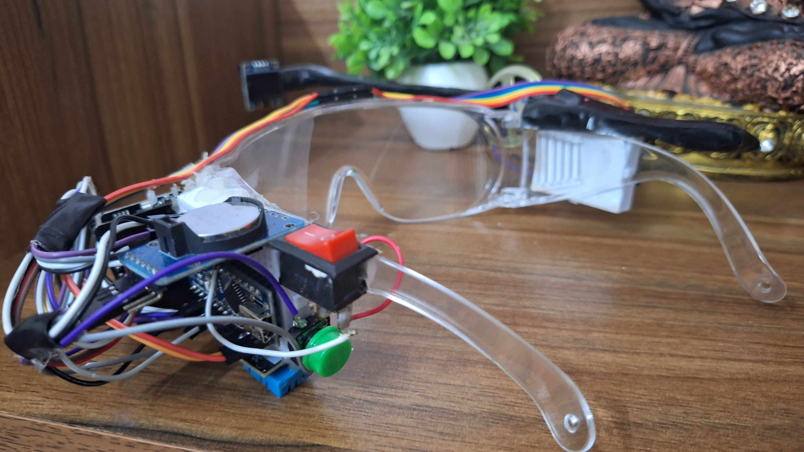
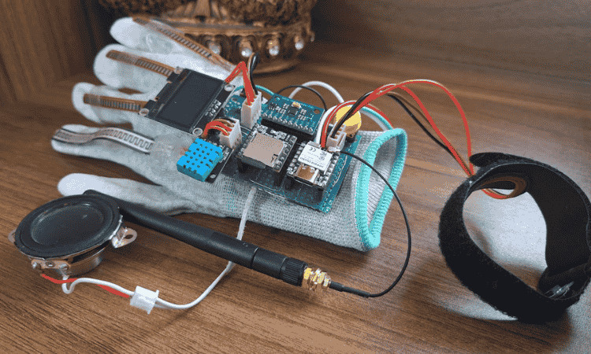
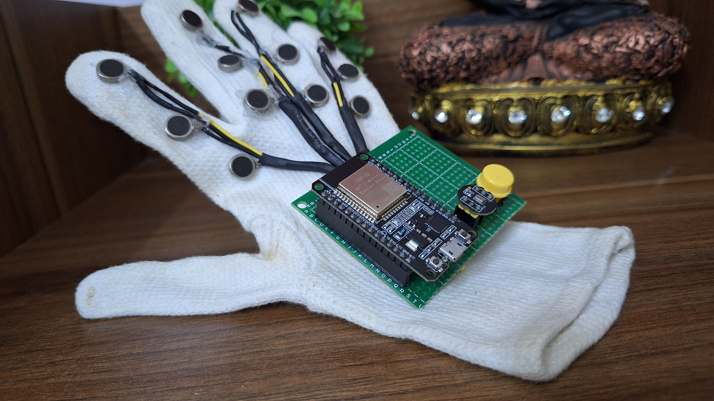
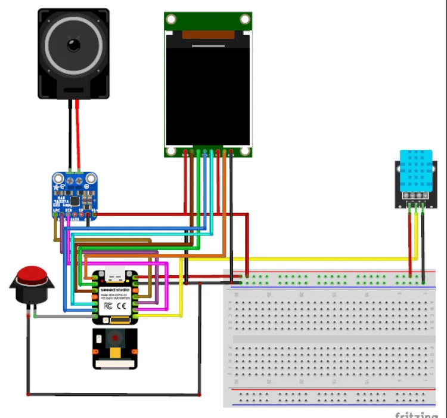
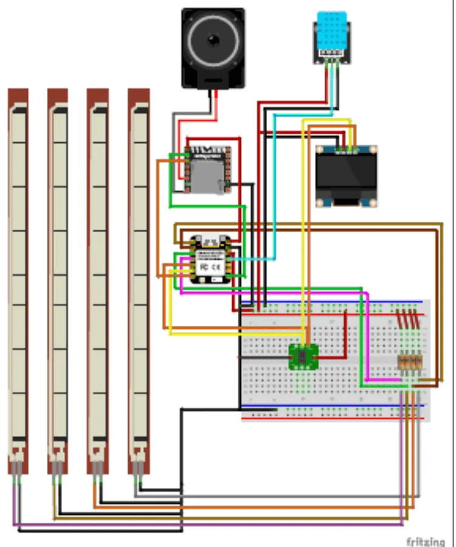
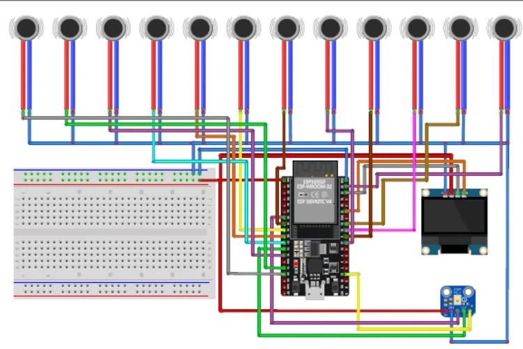

# Gesture Link

> **A Wearable Communication System for Differently Abled**
>
> Bridging communication gaps between visually, hearing, and speech-impaired individuals through a localized, real-time, wearable system.
>
> **Developer:** Moksha Kumbhaj  
> **Status:** Active / Production Ready

---

## Overview

**Gesture Link** is an offline, real-time assistive technology system. It integrates computer vision, speech synthesis, and haptic feedback into two main hardware modules — **Visora** (smart glasses) and a pair of **assistive gloves (Glove A & Glove B)** — to facilitate a direct, two-way communication loop.

```
                  ┌──────────────┐
                  │   Glove A    │ ───[Gesture-to-Speech]───┐
                  └──────────────┘                          ▼
                                                     ┌──────────────┐
                                                     │  Audio/Voice │
                                                     └──────────────┘
                                                            │
                  ┌──────────────┐                          ▼
                  │   Glove B    │ ───[Speech-to-Braille]───┘
                  └──────────────┘
```

---

## System Architecture

The project is structured into three self-contained microcontroller-based subsystems:

```
Gesture-Link/
├── VISORA/    — Smart glasses (ESP32-S3 Sense + Local Python CV)
├── GLOVE-A/   — Gesture-to-Speech glove (ESP32-C6)
└── GLOVE-B/   — Speech-to-Braille glove (ESP32 Dev Module)
```

---

## Visora — Smart Glasses

<p align="center">
  
</p>

Built around the **ESP32-S3 Sense** with an onboard camera. Visora runs computer vision models to detect objects and recognize colors in real-time, providing immediate audio and visual feedback.

### Key Capabilities
* **Real-time Object Detection:** Camera streams video to local Python models, returning object names instantly.
* **Color Recognition:** Integrates OpenCV and `webcolors` to identify surrounding colors.
* **I2S Audio Output:** Speaks findings aloud through a MAX98357A audio amplifier.
* **TFT Display:** Displays status, language options, and feedback on a 1.8" TFT screen (ST7735).
* **Vitals & Environment Monitoring:** Features DHT11 temperature/humidity sensing and MAXREFDES117 bio-sensor for heart rate/SpO2.

---

## Glove A — Gesture to Speech

<p align="center">
  
</p>

Designed for speech-impaired individuals, Glove A captures hand gestures and translates them into synthesized vocal statements.

### Key Capabilities
* **Flex Sensing:** Four precision flex sensors stitched along the fingers detect bend angles.
* **IMU Orientation:** A 6-axis IMU on the back of the hand tracks spatial rotation and movement.
* **Local Playback:** Plays high-quality pre-recorded MP3 phrases using the DFPlayer Mini and a localized speaker.
* **Health Tracking:** Measures body temperature, heart rate, and SpO2. Displays them on an onboard OLED.
* **JSON Web Dashboard:** Serves live sensor telemetry over a local Wi-Fi connection for remote monitoring.

---

## Glove B — Speech to Braille

<p align="center">
  
</p>

Designed for visually and hearing-impaired individuals, Glove B processes microphone audio in real-time and translates it into tactile Braille.

### Key Capabilities
* **I2S Speech Capture:** Captures voice commands through an INMP441 microphone at 16kHz mono.
* **Braille Mapping:** Converts English text to 6-dot Braille binary codes.
* **Haptic Vibration Matrix:** Activates 12 micro vibration motors arranged in a Braille cell layout on the hand.
* **Telemetry OLED:** Shows live system state, active Braille characters, and the full recognized sentence.

---

## Circuit Schematics

To replicate the project, refer to the following schematics:

### 1. Visora Glasses Circuit


### 2. Glove A (Gesture to Speech) Circuit


### 3. Glove B (Speech to Braille) Circuit


---

## Bill of Materials (BOM)

### System Components Overview


| Component | Quantity | Used In | Purpose |
| :--- | :---: | :--- | :--- |
| **ESP32-S3 Sense (Seeed Studio)** | 1 | Visora | Primary controller with camera |
| **ESP32-C6 (Seeed Studio)** | 1 | Glove A | Gesture processing and dashboard |
| **ESP32 Dev Module** | 1 | Glove B | Speech capture and Braille processing |
| **1.8" TFT Display (ST7735)** | 1 | Visora | User feedback & mode selection screen |
| **OLED Displays (1.3" + 0.96")** | 2 | Glove A & B | Telemetry & vitals screens |
| **DHT11 Sensor** | 2 | Visora, Glove A | Environment sensing |
| **MAX98357A I2S Amplifier** | 1 | Visora | Voice announcement speaker driver |
| **DFPlayer Mini** | 1 | Glove A | Local MP3 phrase player |
| **INMP441 I2S Microphone** | 1 | Glove B | High-fidelity audio intake |
| **6-Axis IMU** | 1 | Glove A | Wrist tilt and gesture detection |
| **MAXREFDES117 Bio-Sensor** | 3 | All Modules | Continuous heart rate and SpO2 reading |
| **Flex Sensors** | 4 | Glove A | Finger flexion measurement |
| **Vibration Motors** | 12 | Glove B | Braille feedback cell |

---

## Core Principles

* **Edge Processing:** All logic, computer vision, and speech-to-Braille algorithms run locally on hardware to protect user privacy and minimize response time.
* **Haptic Feedback:** Dynamic vibration intensities convey structural object alerts and Braille text.
* **Two-Way Loop:** Connects users directly through local wireless/wired endpoints.

---

## Future Roadmap

- [ ] Add reinforcement learning for customized user gesture profiles
- [ ] Build a cross-platform mobile app for system analytics and calibration
- [ ] Support multilingual Braille translation profiles
- [ ] Implement an automatic emergency SOS trigger
- [ ] Integrate local GPS for waypoint and navigation assistance
- [ ] Port lightweight tinyml models directly onto the ESP32-S3

---

## AI Integration & Development

AI tools were integrated into the development process of Gesture Link to assist with:
* **Debugging & Verification:** Solved multi-threading challenges on ESP32, resolved logic errors in alternating tactile cells, and ironed out script bugs.
* **Performance Tuning:** Optimized data pipelines for ESP32 and OpenCV computer vision streams.
* **Web UI Engineering:** Created the interactive web demos, modern Glassmorphism aesthetics, and responsive layout designs.
* **Documentation & Research:** Conducted API evaluations and designed layout schematics.

---

## References

* [WHO Vision Impairment Report (2023)](https://www.who.int)
* [Espressif ESP32-S3 & ESP32-C6 Documentation](https://docs.espressif.com)
* [DFPlayer Mini Technical Specifications](https://wiki.dfrobot.com)
* [Analog Devices MAXREFDES117 datasheet](https://www.analog.com)
* Open-Source Core: OpenCV, MediaPipe, webcolors

---

<p align="center">
  <b>© 2026 Moksha Kumbhaj — Gesture Link Project</b>
</p>
